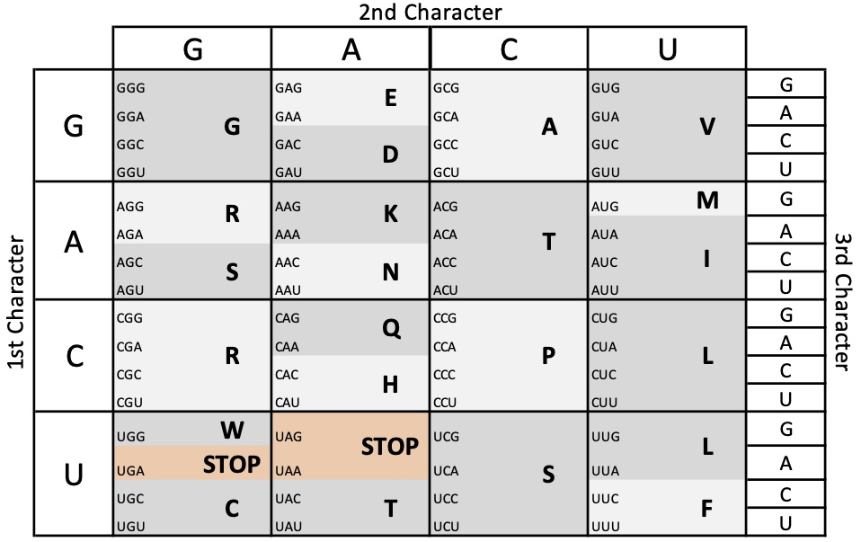
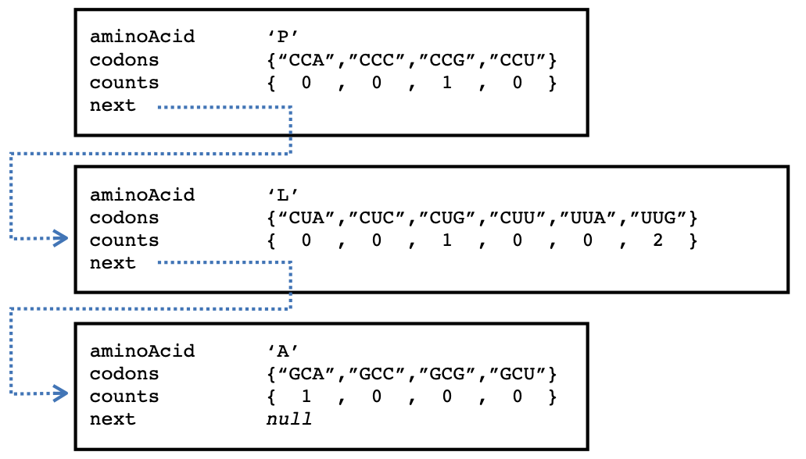
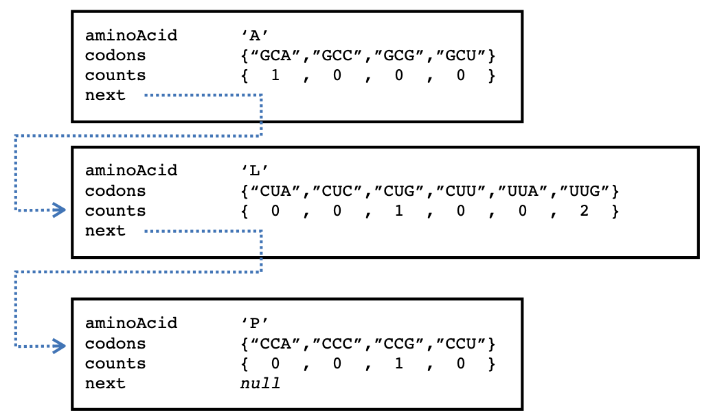

# Weeks 8-9 Lab
In this weeks lab we will work on the computer science concepts of Linked Lists and Sorting. 
We will be doing this by introducing a common task in computational biology: RNA to Amino Acid translation. 
Proteins are encoded in a 20 letter amino acid alphabet but when those proteins are encoded on the genome they are in a 4 letter alphabet. 
To convert from RNA into Amino Acids your cells use a specific code to convert 3 RNA characters (called a codon) into a specific amino acid. 

The codon to Amino Acid map is shown in the figure below. 
Notice that each codon encodes only 1 Amino Acid, but each Amino Acid may corespond to multiple codon sequences. 

Some codons enode a "stop", which halts translation at that point. 
As cells evolve the RNA sequences change which may or may not change the protein sequences. 
Our task will be to translate two (or more) RNA sequences and compare the Amino Acid frequencies. 

## Your task
Create a new linked list type, `AminoAcidLL`, which holds:
* `private char aminoAcid` -- the character representing the Amino Acid stored in this element
* `private String[] codons` -- the codons that represent this Amino Acid
* `private int[] counts` -- the count of the codon usage (`codons.length` will be equal to `counts.length`)
* `private AminoAcidLL next` -- the next element in the linked list, had the value `NULL` when the current element is the last

The methods you will need to create and manage your linked lists for each sequence are:
* `private void addCodon(String inCodon)` -- this will (recursively) add the codon to the linked list, if the Amino Acid already exists it will add it to the count on that node, otherwise it will create a new node. 
* `private int totalCount()` -- this will return the number of times this amino acid is used in the sequence (the sum of all of the codon counts).
* `public int aminoAcidCompare(AminoAcidLL inList)` -- this is a recursive method that returns the difference in counts between two lists of Amino Acids (using the `totalCount()` value). 
* `public int codonCompare(AminoAcidLL inList)` -- this is a recursive method that returns the difference in counts between the two lists of Amino Acids based on the individual codon counts (while the `totalCount()` difference may be 0, the codon difference may be non-zero). 
* `public char[] aminoAcidList()` -- returns an array of the amino acids characters (in the order which they are in within the linked list). 
* `public int[] aminoAcidCounts()` -- returns an array of the counts of the amino acids (in the order which they are in within the linked list). 
* `public boolean isSorted()` -- a recursive method that determines if the remainder of a given linked list is already sorted. 

Your class will also have several static methods that are used to construct and sort a linked list
* `public static AminoAcidLL createFromRNASequence(String inSequence)` -- this will take in the RNA sequence and return the linked list containing only the Amino Acids present in the seuqnece, with the codon counts propigated. Note that the STOP codon does not actually exist in the list, but indicates when translation should stop (this may come before the end of the string). 
* `public AminoAcidLL sort(AminoAcidLL inList)` -- sorts the given linked list by the Amino Acid character in alphanumeric order and returns the new starting node. 

## Given 
You will be provided with a java class `AminoAcidResources` (it is already in your repository) which will have the following methods:
* `public static char getAminoAcidFromCodon(String s)` -- given a String with 3 characters, returns the Amino Acid character. If the codon is invalid the method will return NULL. If the codon is a STOP, the method will return `*`.
* `public static String[] getCodonListForAminoAcid(char a)` -- given an Amino Acid character, returns an array of all possible codons as strings. If the character is not an AminoAcid, the method will return an empty array.  

You will also recive the frame of the `AminoAcidLL` class. Do not change the existing method signitures. Additional methods may be desired and should be added as needed.

## What to turn in
1. `AminoAcidLL.java`
1. `AminoAcidLLTester.java` -- contains at least 10 test cases testing the methods above. 

## Due date
Your assignment must be committed to GitHub by **Friday, ~27 March~ 3 April 2020 @ 11:59pm**, _note the instructors will not be available for help after 6pm on the due date._ 

Late policy: 
* -10 points for assignments turned in 1 day late
* -20 points for assignments turned in 2 days late
* 0 points for assignments turned in later, but should still be turned in for feedback. 

## Grading
| Points | Item | 
| ---- | ----- | 
| 40 | `AminoAcidLLTester.java` | 
| | 4 points per case | 
| 60 | `AminoAcidLL.java` | 
| | 20 points -- `sort` |
| | 5 points (total) -- constructors and `addCodon` | 
| | 5 points -- `createFromRNASequence` | 
| | 5 points (each) -- `aminoAcidList` and `aminoAcidCount` | 
| | 10 points (each) -- `aminoAcidCompare` and `codonCompare` | 

## Recommended Completion Timeline
| Class Day | Items that should be completed by date |
| --- | --- |
| Monday, Week 1 | develop constructor and `createFromRNASequence` unit test cases |
| | develop the `createFromRNASequence` method |
| | develop constructors |
| | develop `addCodon` method | 
| Wednesday, Week 1 | develop counting unit test cases |
| | develop `totalCount` method | 
| | develop `aminoAcidList` and `aminoAcidCount` methods | 
| Monday, Week 2 | develop `sort` unit tests |
| | develop `sort` method |
| Wednesday, Week 2 | develop `aminoAcidCompare` and `codonCompare` unit tests |
| | develop `aminoAcidCompare` method | 
| | develop `codonCompare` method | 

# Extended example
Given the RNA sequence `CCGUUGGCACUGUUG`, the construction method would make the following codon conversions:

After the data structure that is returned is 

Then after we run `sort()`, we would get the following:

